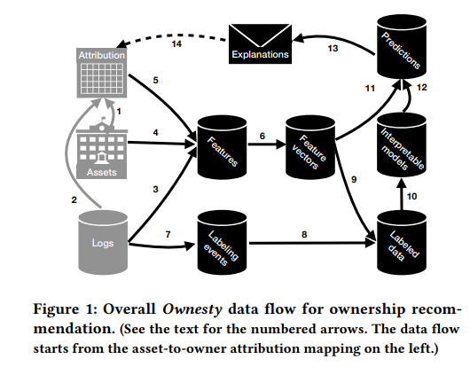

# RESEARCH PAPER 3
#### Paper Title
# Ownership at Large
**__Open Problems and Challenges in Ownership Management
John Ahlgren, Maria Eugenia Berezin, Kinga Bojarczuk, Elena Dulskyte, Inna Dvortsova, Johann george, Natalija Gucevska, Mark Harman, Shan He, Ralf Lämmel, Erik Meijer, Silvia Sapora, and Justin Spahr-Summers.__**

## AUTHORS
|Authors| Site|
|-----------|------|
|John Ahlgren|[Open](https://conf.researchr.org/profile/icpc-2020/johnahlgren)|
|Maria Eugenia Berezin|[Open](https://conf.researchr.org/profile/icpc-2020/mariaeugeniaberezin)|
|Kinga Bojarczuk, Johann George|[Open](https://conf.researchr.org/profile/icpc-2020/kingabojarczuk)|
| Natalija Gucevska, Mark Harman|[Open](https://conf.researchr.org/profile/icpc-2020/natalijagucevska)|
|Shan He|[Open](https://conf.researchr.org/profile/icpc-2020/shanhe)|
|Ralf Lämmel|[Open](https://conf.researchr.org/profile/icpc-2020/ralflammel)|
|Erik Meijer|[Open](https://conf.researchr.org/profile/icpc-2020/erikmeijer1)|
|Silvia Sapora|[Open](https://conf.researchr.org/profile/icpc-2020/silviasapora)|
| Justin Spahr-Summers|[Open](https://conf.researchr.org/profile/icpc-2020/justinspahrsummers)|

  
 >**Track :** [ICPC 2020 Industry](https://conf.researchr.org/track/icpc-2020/icpc-2020-industry?track=ICPC%20Industry)

> **A the time :** Wed 15 Jul 2020 02:00 - 02:15 at ICPC - Session 10: Documentation Chair(s): Gias Uddin
 
 #### Conference (and Link): 
https://conf.researchr.org/details/icpc-2020/icpc-2020-industry/2/Ownership-at-Large-Open-Problems-and-Challenges-in-Ownership-Management

**Paper PDF link**
["Click here to open the paper PDF"](https://research.fb.com/wp-content/uploads/2020/05/Ownership-at-Large-Open-Problems-and-Challenges-in-Ownership-Management.pdf )

# Introduction
This research is about managing the software asset Ownership in different organizations and platform. Every industry cover with its well-mannered ownership responsibilities. Such as security, reliability, task code maintainability and so on. So for all these requirements Ownership managment in software engineering is highly recommended. In this paper the word **asset** refer to source code files, tables, warehousing. Whereas word **owner** refers to Set of people taking responsibility for the asset. And the work will be done on facebook
#### Motivation
The motive of the paper is to working on set of  challenges and nd finding the open problems for proceeding research agenda on the Ownership management.
 # Research Methodology
 #### THE OWNESTY SYSTEM
 It is used at the Facebook.
**i. Vocabulary of Ownership Management :** It works on ownesty at facebook. Where special parts of system (asset-to-owner attribution mapping ) are assumed and mentioned as Owner. That asset-to-owner mapping can be modified and when asset mapped with any new owner then this credibly referred as **Ownership Transfer**. the main objective of Ownesty is to endorse satisfactory owner and also vindicate the ownership health.
**ii. The ML Architecture**

The figure is showing all the details of Data Flow computation. The gray arrows are for the asset-to-owner attribution mapping ownesty. The ownesty **logs 3** is taking out the apropose form of interaction between owner and asset. Ownesty authority overlook and depend on labelled data for positive and negative attribution so "labeling events" are extracted from **logs 7**.
**iii. Ownership At Large**  here facebook Ownership Management is described by using some keys measurement.Such as Number of asset type, Number of asset type t . , Number of owner types, Number of owner candidates of type t. , Number of (shortlisted) owner candidates for a given asset, Daily churn for asset type t. , Daily owner churn for asset type t. . these are consequence of sequencing efforts on ownership
management at Facebook, based on Ownesty.
#### Open problems And Challenges
following are the open problems and challenges described by research areas around ownership.
**i. Heterogeneity of Owned Assets  :**  Ownership recommendation carry resemblance with reviewer recommendation which goals to recommend reviewer for new reinforcement (diffs , commits) consisting on inhabit moddel build on past reinforcement and possibly other data. ownership requirment urgency  to heterogeneity of asset type **for instance** Database and Software configuration. Each asset inhabit plenty of information regulating suitable owner.
**ii. Dependency Awareness :**  It is compulsion to grip and respect the dependencies. So it again take reviewer recommendation heterogeneous dependencies. These dependencies are accumulated between regular and library code over all developers. So research with various software engineering process are integrated to ownership management. 
**iii. Workflow and Organizational Aspects :** Different types of assets and owner candidates generalized analysis is required by owner recommendation and diverse form of interactions. for organizational aspects of ownership management Human-to-asset and human-to-human interactaion and collaboration helps a lot. In this aspects developers can entered the realm of global software engineering [11, 13, 14, 44].
**iv. Understandable Recommendations**
It is very important for the owner to understand the recommendation and detects domain specification .The following domain specify the ownership recomendation for the detected research.
The relationship between asset aand owner may independently unsettled.
The process of over ownership Like communicating, deciding and discussing is social.
The side affect of Ownesty is providing the information that is not available.
# Result
The research is being made for defining the approach of ownership management and its particular view points of using ownernship recommendation and its attributes. In this research **Facebook Owensty** is introduced illustrated. Along with this,  research open problems and challenges were set in the activities and communities.