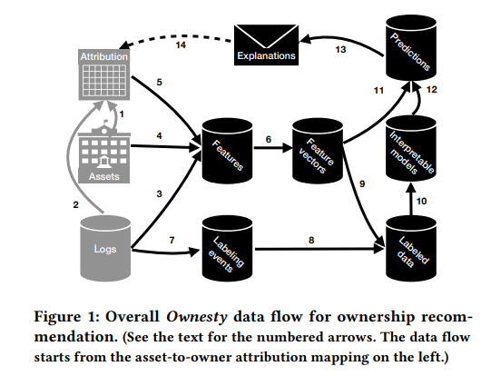

# RESEARCH PAPER 1
#### Paper Title

# Employing Contribution and Quality Metrics for Quantifying the Software Development Process
***Themistoklis Diamantopoulos, Michail D. Papamichail, Thomas Karanikiotis Kyriakos C. Chatzidimitriou, and Andreas L. Symeonidis
  (thdiaman,mpapamic,thomas.karanikiotis,kyrcha)
     @issel.ee.auth.gr,asymeon@eng.auth.gr Electrical and Computer Engineering Dept., Aristotle University of Thessaloniki Thessaloniki, Greece***

## AUTHORS
+ Themistoklis DiamantopouloS
+ Michail Papamichail
+ Thomas Karanikiotis
+ Kyriakos Chatzidimitriou
+ Andreas Symeonidis
+ **Track**  MSR 2020 Data Showcase

>At the time: Tue 30 Jun 2020 10:52 - 11:00 at MSR:Zoom - 
Quaility Evolution ***Chair(s): Jürgen Cito***

####Conference (and Link):
 https://2020.msrconf.org/details/msr-2020-Data-showcase/7/Employing-Contribution-and-Quality-Metrics-for-Quantifying-the-Software-Development-P

**Paper PDF link**
["Click here to open the papr PDF"](https://issel.ee.auth.gr/wp-content/uploads/2020/05/MSR2020.pdf )

#Introduction
 This research paper is about the Collaborative work of employeeqs and their measurement for software development values. AS software development is arising rapidly and become a collaborative process of taking part in online hosting programming services. ***For Example:*** Github , Bitbucket or Gitlab. Developers are doing collective work as software engineering is providing enormous facilities. __Github__ is a repository hosting services, it is providing web graphical interface , access control and collaborative features. In these collaborative materials , software projects are the combinations of different contribution. This collaboration is a multiple axes having so many things from coding a project to its debugging process, it includes each and  every information. Thus all the data combine and form a **"story"** of all project containing answers of every ___W.H Question___.
 #### Motivation
The basic motive of the research is the dataset of monitoring what we call the ***story*** of the project consider as ***Agile Methodoloy*** having goal of building high quality software. The ***Github*** infrastructure examines all the data contribution. Sum-up the employees contibutions and quality measurement that answer every arising question.

# Research Methodology
####Architecture And Tools
The architecture of this platform is involving four given below modules.
 ***__i Data Downloader :__*** It is a Python application that uses all the GitHUb repository to fetch all the offered information. This information contain issues, comments, issue commits, issues events, repository information, contributors information and the source code repository as well.
***__ii. MangoDB Management :__*** It is used as the database management system, having all the raw data repossess from GitHub accompanying results of contribution and quantity analysis. Data are arranged in collection icdicating different types of information. for more afficient data the files of information are connected through elements like repository name, commit etc.
***__iii. Contributor Analyzer :__*** It uses the information retrieved from GitHub in order to enumerates a series of measure that quantify the activity of each contributor in terms of both, development and operations. The logic behind the selection of these metrics derives from their use in current research [9, 12, 15, 16, 20] from a development and operations standpoint.
 ***__iv. Quality Analyzer__*** Effectual tracking of the software development process needs analyzing the quality of the final product. so for overall evolution of product's lifecycle , statical analysis on weekly basis is being performed to recognize  the generally accepted coding implementation.

 

#### DATASET And Construction
In software development process the online repository comprises vital part. constituting serial provocation and providing list of chances that are swamp to the accessible data to enable and compute the software development to form a worthwhile rise model. these data are inhabiting in GitHub to form a dataset, used for that objective. It also contain some challenges given below :
***i .*** Which project to Analyze: Creating dataset for wrapping the huge range of different synopsis in which about 3,000 project are being analyzed to reveal projects's all information (popularity, complexity, number, size,contribution, duration.
***ii .*** Which metric  to compute: Software development is a superficial task that involves the parameter essential for deliberation. These parameters are discrete characterstics involving project's work, tendency, contribution,collaberation. well in this process contributor can also change within the roles  of project.
***iii .*** Enable tailor-made dataset construction: The main target of the whole scenario is that to impart the dataset that is formable enough to used by researcher to tangled vast range of queries. The frameworks of both, repositories and contributions are enabled to refine data based on sole need and objectives of each researcher.

#### Impact And Research Direction
This dataset can be used to square up to the various challenges in research methodology. As it contain various software process metrics with instant of infraction. So the developers manner can be analyzed in various axes. Such as debugging, commit issues comment distribution and contribution metrics. The dataset include source code, textual and process data that can be excavate to take out the areas of expertise for each developers. so that it will help developers to manage their profile and find best team match. Research in field of automated bug assignment is very wide and use in many metrics of this dataset.

# Result
The research is being made for the excavate contribution data from GitHub that gives useful insights on software development process and produce practical result that may be used to upgrade it. This research turn out the area for building the useful metrics. The dataset in this research is providing facility to answer the various research queries.

#
#
# 

# RESEARCH PAPER 2
#### Paper Title
# Exploring the Security Awareness of the Python and JavaScript Open Source Communities 
***Gábor Antal, University of Szeged, Szeged, Hungary
antal@inf.u-szeged.hu
Márton Keleti University of Szeged, Szeged, Hungary
keletim@inf.u-szeged.hu
Péter Hegedűs, MTA-SZTE Research Group on,Artificial Intelligence,Szeged, Hungary
hpeter@inf.u-szeged.hu***

##AUTHORS
+ Gabor Antal
+  Peter Hegedus
+  Márton Keleti
**Track** MSR 2020 Mining Challenge
>At the timeMon 29 Jun 2020 12:40 - 13:00 at MSR:Zoom2 - MSR Mining Challenge Chair(s): Antoine Pietri, Stefano Zacchiroli, Diomidis Spinellis

####Conference (and Link): 
https://2020.msrconf.org/details/msr-2020-mining-challenge/3/Exploring-the-Security-Awareness-of-the-Python-and-JavaScript-Open-Source-Communities

**Paper PDF link**
["Click here to open the papr PDF"](https://arxiv.org/pdf/2006.13652.pdf )

# Introduction
This research is about Exploring Software security awareness of two open-resource communities, Python and JavaScript. AS software security is one of the obvious problrm that , identifies threats that target most software, impacting the security vulnerability on the daily basis. so in this research it will defined how to how to examine vulnerability mitigation. And for this eximination Python and JavaScript open-source projects are being targeted as the both are the most popular and widely used languages in surroundings. On the basis of Software Heritage Graph Dataset containing development history of publically available software it is being find that JavaScript security vulnerability is falling into 87 various catogries whereas Python is falling into 71 catogries out of which 55 security vulnerability are common.
####Motivation
The basic focus of the ressearch is working on  : What are the typical security vulnerability types the JavaScript and Python open-source communities mitigate and how do they relate to each other? And How quickly the JavaScript and Python open-source communities mitigate a newly published security vulnerability?

# Research Methodology
#####Approach
Heuristics-based approach is used to gather the vulnerability mitigation commits for Python and JavaScript. All the commits are searched on “CVE-”, “CWE-”, “NVD-” patterns by using SQL queries. And the most widely used commits messagess are on CWE identifier. So we first create a temporary table named cve_rev with 357,757 row is created. Then after that Python revision is considered to check as if it must contain the root directory either _init_py or setup. py. python module is project can not be used without it. Same happens with JavaScript revision too , to check it must contain either index.js, app.js, server.js . In the second step 3,718 rows for Python and 4,136 rows for JavaScript are retrieved that are stored in new table named cve_revs_py and cve_revs_js, respectively.
**Tools and Queries for Data Mining :** Python and JavaScripts revision are primed and message committed by CVE/CWE. Commit message can containt same IDs of CVE/CWE for enormous time but only one entry of CVE/CWE is counted once per revision. To focusing on vulnerability types, link the each CVE entries with parallel CWE catogries vulnerabilities. some revision also contained the CWE groups without specifying any perticcular CVE entries.
**Software Heritage Graph Dataset Version :** Software Heritage properly import the dataset into local database with some alterations to the original load script. Size of database is quite large so data importing may take some time even if you are using very high speed hardware.

##### Results and Related work
After the revision work a total 3,458 vulnerability mitigation commits for JavaScript and 2,884 for Python. To which CWE types groups are resolved. From 2015 to 2018 JavaScript vulnerability ratio is growing continuesly whereas  python's vulnerability ratio is quite stable
**i.** Typical Vulnerability issues Types (RQ1): From RQ1 vulnerabulity mitigation commits 103 CWE catogries types are extracted and out of which 55 CWE types are common in both Python and JavaScripts, 32 groups are found in JavaScript and remaining 16 are in Python.
**ii.** Reaction Times to Security Issues (RQ2): In this commit average nmuber of days wearing on between mitigation commit date and publiched date of CVE entry are mentioned. 2010 to 2014 for Pythoon and 2017 for JavaScripts are the peak years for both of comminities to start mitigating vulnerabilities in their code. And if CVE entries never mitigated then it could be good research for future methodology.JavaScript vulnerablitiy reacts fast informationm in CWE 200 type took almost 50days whereas it took 200days in python for CWE type vulnerability.
vulnerability cycle [6,19] helps other to understand the its nature and analyzing the bug prediction. In thids procee  Li et Paxson [8] conduct large-scale empiriacl work with above 4000 patches to find out vulnerability fix life cycle and ccharacterstics. for security identificaton the Xu et al. [24] proposed a binary-level patch analysis framework called SPAIN. Vásquez et al. [23] analyzed 660 Android-related vulnerabilities
and used with both NVDb and Google Andriod security.
##### Threats to validty
Most of the time the mention the CVE IDx explicitly so in that case the actual vulonerability can be  drop its validity. So to nevalute this threat randomly 700 mcommit messages are evaluted from identifier revision.

# Result
The research is being made for exprloring the vulnerability mitigation commits and its identifying types in the Python and JavaScript. 103 different CWE group were detected. It is concluded that JavaScript and Python communities both suffer the most from different types of vulnerabilities. It is observed that different languages have different typical vulnerability catogaries and they can be overlap.

#
#
# 

# RESEARCH PAPER 3
#### Paper Title
# Ownership at Large
**__Open Problems and Challenges in Ownership Management
John Ahlgren, Maria Eugenia Berezin, Kinga Bojarczuk, Elena Dulskyte, Inna Dvortsova, Johann george, Natalija Gucevska, Mark Harman, Shan He, Ralf Lämmel, Erik Meijer, Silvia Sapora, and Justin Spahr-Summers.__**

## AUTHORS
+ John Ahlgren
+ Maria Eugenia Berezin
+ Kinga Bojarczuk, Johann George
+ Natalija Gucevska, Mark Harman
+ Shan He, Ralf Lämmel
+ Erik Meijer, Silvia Sapora
+ Justin Spahr-Summers 
  
 **Track** ICPC 2020 Industry
> A the time : Wed 15 Jul 2020 02:00 - 02:15 at ICPC - Session 10: Documentation Chair(s): Gias Uddin
 
 #### Conference (and Link): 
https://conf.researchr.org/details/icpc-2020/icpc-2020-industry/2/Ownership-at-Large-Open-Problems-and-Challenges-in-Ownership-Management

**Paper PDF link**
["Click here to open the papr PDF"](https://research.fb.com/wp-content/uploads/2020/05/Ownership-at-Large-Open-Problems-and-Challenges-in-Ownership-Management.pdf )

# Introduction
This research is about managing the software asset Ownership in different organizations and platform. Every industry cover with its well-mannered ownership responsibilities. Such as security, reliability, task code maintainability and so on. So for all these requirements Ownership managment in software engineering is highly recommended. In this paper the word **asset** refer to source code files, tables, warehousing. Whereas word **owner** refers to Set of people taking responsibility for the asset. And the work will be done on facebook
####Motivation
The motive of the paper is to working on set of  challenges and nd finding the open problems for proceeding research agenda on the Ownership management.
 # Research Methodology
 #### THE OWNESTY SYSTEM
 It is used at the Facebook.
**i. Vocabulary of Ownership Management :** It works on ownesty at facebook. Where special parts of system (asset-to-owner attribution mapping ) are assumed and mentioned as Owner. That asset-to-owner mapping can be modified and when asset mapped with any new owner then this credibly referred as **Ownership Transfer**. the main objective of Ownesty is to endorse satisfactory owner and also vindicate the ownership health.
**ii. The ML Architecture**

The figure is showing all the details of Data Flow computation. The gray arrows are for the asset-to-owner attribution mapping ownesty. The ownesty **logs 3** is taking out the apropose form of interaction between owner and asset. Ownesty authority overlook and depend on labelled data for positive and negative attribution so "labeling events" are extracted from **logs 7**.
**iii. Ownership At Large**  here facebook Ownership Management is described by using some keys measurement.Such as Number of asset type, Number of asset type t . , Number of owner types, Number of owner candidates of type t. , Number of (shortlisted) owner candidates for a given asset, Daily churn for asset type t. , Daily owner churn for asset type t. . these are consequence of sequencing efforts on ownership
management at Facebook, based on Ownesty.
#### Open problems And Challenges
following are the open problems and challenges described by research areas around ownership.
**i. Heterogeneity of Owned Assets  :**  Ownership recommendation carry resemblance with reviewer recommendation which goals to recommend reviewer for new reinforcement (diffs , commits) consisting on inhabit moddel build on past reinforcement and possibly other data. ownership requirment urgency  to heterogeneity of asset type **for instance** Database and Software configuration. Each asset inhabit plenty of information regulating suitable owner.
**ii. Dependency Awareness :**  It is compulsion to grip and respect the dependencies. So it again take reviewer recommendation heterogeneous dependencies. These dependencies are accumulated between regular and library code over all developers. So research with various software engineering process are integrated to ownership management. 
**iii. Workflow and Organizational Aspects :** Different types of assets and owner candidates generalized analysis is required by owner recommendation and diverse form of interactions. for organizational aspects of ownership management Human-to-asset and human-to-human interactaion and collaboration helps a lot. In this aspects developers can entered the realm of global software engineering [11, 13, 14, 44].
**iv. Understandable Recommendations**
It is very important for the owner to understand the recommendation and detects domain specification .The following domain specify the ownership recomendation for the detected research.
The relationship between asset aand owner may independently unsettled.
The process of over ownership Like communicating, deciding and discussing is social.
The side affect of Ownesty is providing the information that is not available.
# Result
The research is being made for defining the approach of ownership management and its particular view points of using ownernship recommendation and its attributes. In this research **Facebook Owensty** is introduced illustrated. Along with this,  research open problems and challenges were set in the activities and communities.